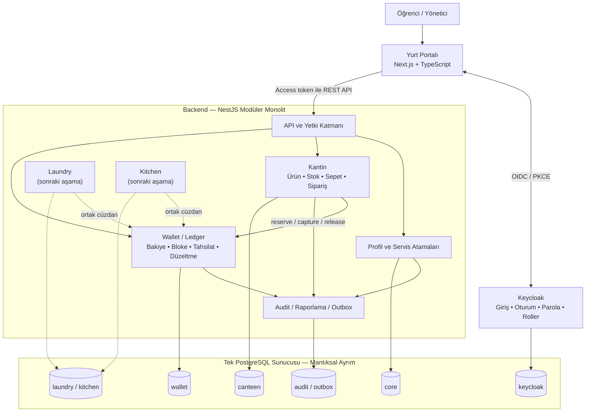
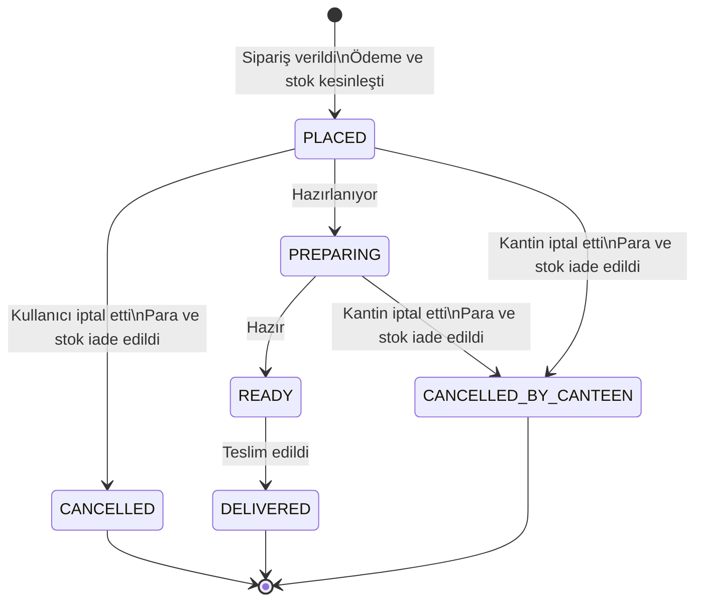

# Yurt Hizmet Portalı — Ürün Kapsamı ve Mimari

**Durum:** Onaylandı  
**Tarih:** 20 Ağustos 2026  
**İlk teslim hedefi:** Merkezi giriş, ortak cüzdan ve kantin sistemi

## 1. Amaç

Yurt sakinlerinin ve yetkili görevlilerin tek bir arayüzden yurt hizmetlerine erişmesini sağlayan bir portal geliştirilecektir. Kullanıcı bir kez giriş yapacak; yetkisine göre kantin, ileride laundry ve kitchen gibi modülleri aynı portal içinde kullanacaktır.

İlk sürümde yalnızca şu alanlar çalışır olacaktır:

- Merkezi kullanıcı girişi ve rol yönetimi
- Bütün hizmetlerin kullanacağı ortak cüzdan/bakiye sistemi
- Kullanıcı ve görevli taraflarıyla kantin sistemi

Laundry ve kitchen portalda gelecekte eklenecek hizmetler olarak düşünülecek, ancak işlevleri ilk sürümde geliştirilmeyecektir.

## 2. Temel mimari kararlar

- Sistem ilk aşamada **modüler monolit** olarak geliştirilecektir.
- Modüller aynı backend uygulamasında çalışacak fakat kendi iş kurallarına ve veri alanlarına sahip olacaktır.
- Bir modül başka bir modülün tablolarını doğrudan değiştirmeyecektir.
- Kimlik doğrulama ve parola yönetimi uygulama içinde yazılmayacak; **Keycloak** kullanılacaktır.
- Bütün hizmetler için tek ve merkezi bir **Wallet/Ledger** modülü bulunacaktır.
- Veritabanı olarak **PostgreSQL** kullanılacaktır.
- Kullanıcı arayüzü ve backend için ana dil **TypeScript** olacaktır.
- İlk kurulum yalnızca yurdun yerel ağında ve HTTP üzerinden çalışacaktır.
- Başlangıçta mesaj kuyruğu veya ayrı mikroservisler kurulmayacaktır.

## 3. Sistem görünümü

## 4. Teknoloji yığını

| Alan               | Seçim                                    |
| ------------------ | ---------------------------------------- |
| Frontend           | TypeScript + Next.js                     |
| Backend            | TypeScript + NestJS                      |
| API                | REST + OpenAPI                           |
| Kimlik ve oturum   | Keycloak, OIDC Authorization Code + PKCE |
| Veritabanı         | PostgreSQL                               |
| Mimari             | Modüler monolit                          |
| İlk çalışma ortamı | Yurt yerel ağı, HTTP                     |

## 5. Kimlik ve kullanıcı yaşam döngüsü

### Hesap oluşturma ve giriş

- Hesapları yalnızca yetkili yönetici oluşturur.
- Kullanıcı telefon numarası ve parola ile giriş yapar.
- Telefon numarası uluslararası biçimde saklanır; örnek: `+905xxxxxxxxx`.
- Yönetici kullanıcıya geçici parola verir.
- Keycloak kullanıcıyı ilk girişte parolasını değiştirmeye zorlar.
- İlk sürümde SMS veya e-posta doğrulaması bulunmaz.
- Unutulan parola yönetici tarafından sıfırlanır.
- Telefon numarası giriş kimliğidir; sistemdeki kalıcı kullanıcı anahtarı değildir.
- Uygulamadaki kullanıcı profili Keycloak kullanıcısına değişmeyen `subject` değeriyle bağlanır.

### Hesap durumları

- `ACTIVE` — Kullanıcı giriş yapabilir.
- `SUSPENDED` — Giriş geçici olarak engellenir.
- `DEPARTED` — Kullanıcı yurttan ayrılmıştır ve giriş yapamaz.
- Kullanıcılar fiziksel olarak silinmez.
- Hesap durumu değişse de sipariş ve cüzdan geçmişi korunur.
- Hesap yeniden etkinleştirilirse mevcut bakiye kullanılmaya devam eder.

## 6. Roller ve yetkiler

Bir kişinin öğrenci veya yönetici olması, kantin göreviyle aynı kavram değildir. Bir öğrenci de yetkili kantin görevlisi olabilir. Yetkiler rol üzerinden verilir.

| Rol                | Yetkiler                                                                                         |
| ------------------ | ------------------------------------------------------------------------------------------------ |
| `portal_user`      | Portalı ve izin verilen hizmetleri kullanır; sipariş verir; kendi bakiye ve siparişlerini görür. |
| `platform_admin`   | Kullanıcı oluşturur; hesap durumlarını ve rol atamalarını yönetir.                               |
| `canteen_operator` | Sipariş kuyruğunu yönetir; stok değiştirir; ürünü satışa açar veya kapatır.                      |
| `canteen_manager`  | Operatör yetkilerine ek olarak ürün oluşturur ve fiyat değiştirir.                               |
| `wallet_cashier`   | Nakit karşılığı bakiye yükler ve hatalı para işlemleri için ters kayıt oluşturur.                |

Keycloak'ın teknik yönetici rolleri işletme rollerinden ayrı tutulacaktır. Uygulama yöneticilerine gereksiz Keycloak yönetim yetkileri verilmeyecektir.

İlk arayüz tek kantin gösterecektir. Bununla birlikte ürün, sipariş ve görevli atamaları bir `canteen_id` ile ilişkilendirilecek; veri modeli ileride birden fazla kantini destekleyecektir.

İlk kullanıcı kataloğunda yalnızca `canteen-main` kodlu **Ana Kantin** görünür. `Test Kantini` geliştirme verisi olarak sistemde kalabilir ancak kullanıcı kataloğuna çıkarılmaz.

## 7. Merkezi cüzdan ve para kuralları

Wallet kantine ait değildir; bütün mevcut ve gelecekteki hizmetlerin kullanacağı merkezi bir modüldür.

### Temel kurallar

- Her kullanıcının hizmetlerden bağımsız tek bakiyesi bulunur.
- Yeni kullanıcıya sıfır bakiyeli TRY cüzdanı otomatik açılır; mevcut kullanıcılar geçiş sırasında tamamlanır.
- Kullanıcı bakiyesi negatif olamaz.
- Para karttan veya çevrim içi ödeme sistemiyle yüklenmez.
- Kullanıcı nakit parayı `wallet_cashier` yetkili görevliye verir; görevli bakiyeyi sisteme yükler.
- Kasiyer yükleme tutarını yalnızca tam TL olarak girer; kuruşlu nakit yükleme yapılmaz.
- Kasiyer kendi cüzdanına bakiye yükleyemez.
- Kullanıcı bakiyesini nakit olarak geri çekemez.
- Kullanıcı yurttan ayrılsa bile para cüzdanda kalır.
- Kullanıcı kullanılabilir bakiyesini, bloke tutarını ve işlem geçmişini görebilir.
- Kullanıcı başka kullanıcıların cüzdan bilgilerini göremez.

### Hareket defteri

- Bakiye yalnızca değiştirilebilir tek bir sayı olarak tutulmaz; bütün hareketler değişmez bir ledger içinde kaydedilir.
- Para hareketleri silinmez ve mevcut kayıtlar düzenlenmez.
- `wallet_cashier` yalnızca hatalı nakit yüklemeyi gerekçe girerek ters kayıtla düzeltebilir.
- Nakit yükleme yalnızca tam tutarıyla, bir kez ters çevrilir; kısmi ters kayıt yapılmaz.
- Kısmi hata varsa yükleme tamamen geri alınır ve doğru tutar yeni hareket olarak girilir.
- Sipariş ödemeleri ve hizmet iadeleri yalnızca ilgili hizmet akışı tarafından yönetilir; kasiyer bunları ters çeviremez.
- Tam ters kayıt kullanıcı bakiyesini negatife düşürecekse işlem reddedilir.
- İşlemi yapan kişi, tarih, tutar, işlem türü ve ilgili sipariş/hizmet kaydedilir.
- Tutarlar PostgreSQL'de kuruş cinsinden `BIGINT` olarak tutulur.
- TypeScript tarafında parasal değerler `number` ile hesaplanmaz; `bigint` veya güvenli string temsili kullanılır.
- Her para işlemi PostgreSQL transaction'ı içinde yürütülür.
- Tekrarlanan isteklerin çift para hareketi oluşturmaması için `idempotency_key` kullanılır.

### Sipariş ödeme akışı

1. Kullanıcı sipariş verdiğinde yeterli kullanılabilir bakiye kontrol edilir.
2. Sipariş tutarı kullanıcının bakiyesinden anında düşülür.
3. Sipariş `PLACED` durumunda oluşturulur; ayrıca görevli kabulü gerekmez.
4. Kullanıcı hazırlama başlamadan iptal ederse tutar bakiyesine iade edilir.
5. Kantin siparişi hazırlama öncesinde veya sırasında iptal ederse tutar otomatik iade edilir.

## 8. Kantin ürün ve stok kuralları

- Günlük/özel menü için ayrı kategori veya zamanlama sistemi bulunmaz.
- Bütün ürünler aynı ürün modelini kullanır.
- İlk sürümde ürün fotoğrafı bulunmaz.
- `canteen_manager` ürün adı, fiyat ve ilk stok miktarıyla ürün oluşturur.
- Ürün fiyatı yalnızca tam TL, stok ise yalnızca tam adet olarak girilir; ikisi de veritabanında tamsayı olarak saklanır.
- Aynı kantinde aynı adla ikinci ürün oluşturulmaz. Mevcut veya arşivlenmiş ürünün fiyatı, stoğu ve satış durumu güncellenir.
- `canteen_operator` ürün stoklarını günceller ve ürünü satışa açıp kapatır.
- Yeni ürünün stoğu sıfırdan büyükse ürün otomatik olarak satışa açılır.
- Sepete ürün eklemek stok azaltmaz.
- Sipariş oluşturulduğunda ürün miktarı stoktan anında düşülür.
- Kullanıcı veya kantin siparişi iptal ederse ürün miktarı stoğa iade edilir.
- Stok sıfır olduğunda ürün otomatik olarak kullanıcı listesinden gizlenir.
- Ürüne yeniden stok girildiğinde tekrar satışa açılabilir.
- Sipariş geçmişinde kullanılmış ürün fiziksel olarak silinmez; pasif/arşiv durumuna alınır.
- İlk sürümde ürün seçenekleri, kişiselleştirme ve sipariş notları bulunmaz.

### Fiyat geçmişi

- Sipariş kalemi sipariş anındaki ürün adını ve birim fiyatı kendi üzerinde saklar.
- Sonraki fiyat değişiklikleri bekleyen veya geçmiş siparişleri etkilemez.
- Yeni fiyat yalnızca sonraki siparişlerde kullanılır.
- Fiyat ve stok değişiklikleri audit kaydına alınır.

## 9. Sipariş yaşam döngüsü

### Sipariş kuralları

- Kantin görevli tarafından manuel olarak siparişe açılır veya kapatılır.
- Kantin kapalıyken kullanıcı ürünleri görebilir fakat sipariş veremez.
- Sipariş ayrıca görevli kabulü beklemeden doğrudan alınır.
- Kullanıcı siparişi yalnızca `PLACED` durumundayken iptal edebilir.
- Hazırlama başladıktan sonra kullanıcı tarafından iptal edilemez.
- Hazırlama öncesinde veya sırasında iptal gerektiğinde kantin görevlisi işlemi yapar; para ve stok otomatik iade edilir.
- İlk sürümde yalnızca kantinden teslim alma vardır; odaya teslimat yoktur.
- Görevli hazır siparişi kod doğrulaması olmadan teslim edildi olarak işaretler.
- Sipariş durumu ilk sürümde yalnızca uygulama içinde gösterilir.

## 10. İlk sürüm ekranları

### Kullanıcı

- Ortak giriş ekranı
- Servislerin bulunduğu portal ana sayfası
- Kantin ürün listesi
- Sepet ve sipariş onayı
- Aktif sipariş durumu
- Geçmiş siparişler
- Bakiye, bloke ve cüzdan hareketleri

### Kantin görevlisi ve yöneticisi

- Gelen sipariş kuyruğu
- Sipariş ayrıntısı ve durum değiştirme
- Ürün listesi
- Stok yönetimi
- Ürünü satışa açma/kapatma
- Ürün oluşturma ve fiyat yönetimi (yalnızca `canteen_manager`)
- Kantini siparişe açma/kapatma

### Sistem ve cüzdan yönetimi

- Kullanıcı oluşturma
- Geçici parola ve parola sıfırlama
- Kullanıcı durumunu değiştirme
- Rol atama
- Nakit bakiye yükleme
- Para işlemi için gerekçeli ters kayıt oluşturma
- Audit kayıtlarını görüntüleme

## 11. Veri sahipliği

İlk tablo adları kesin şema değildir; modül sorumluluklarını göstermek içindir.

| Veri alanı | Sahibi          | Örnek kayıtlar                                                                        |
| ---------- | --------------- | ------------------------------------------------------------------------------------- |
| Keycloak   | Keycloak        | Kullanıcı kimliği, parola, oturum, Keycloak rolleri                                   |
| `core`     | Profil modülü   | Uygulama kullanıcı profili, Keycloak subject bağlantısı, hesap durumu, servis ataması |
| `wallet`   | Wallet modülü   | Cüzdan hesabı, ledger işlemi, ledger satırı, bloke, ters işlem                        |
| `canteen`  | Kantin modülü   | Kantin, ürün, stok rezervasyonu, sipariş, sipariş kalemi, durum geçmişi               |
| `audit`    | Audit altyapısı | Yönetim işlemleri ve ileride dış olaylara dönüşebilecek outbox kayıtları              |

Modüller arası bağlantılarda değişmeyen UUID değerleri kullanılacaktır. Kantin modülü Wallet tablolarına doğrudan yazmayacak; Wallet'ın uygulama arayüzünü çağıracaktır.

## 12. Yerel ağ ve çalışma ortamı

- Sistem yalnızca yurdun yerel ağından erişilebilir olacaktır.
- İlk aşamada yerel IP ve HTTP kullanılacaktır.
- Web arayüzü, API ve Keycloak giriş uçları yerel ağdaki kullanıcılara açılır.
- PostgreSQL portu ve Keycloak yönetim alanları normal kullanıcılara açılmaz.
- İnternetten sisteme gelen bağlantı kabul edilmez.
- İleride bildirim servisi eklenirse yalnızca dışarı yönlü internet erişimi verilebilir.
- Yerel DNS ve HTTPS daha sonraki aşamada değerlendirilecektir.

## 13. İlk sürüm dışında kalanlar

- Kart veya çevrim içi ödeme
- Kullanıcının nakit bakiye çekmesi
- SMS, e-posta, tarayıcı push bildirimi
- Ürün seçenekleri ve kişiselleştirme
- Sipariş notları
- Odaya teslimat
- Otomatik kantin çalışma saatleri
- Günlük menü için ayrı kategori veya zamanlama
- Laundry ve kitchen işlevleri
- Ayrı mikroservisler ve mesaj kuyruğu
- İnternete açık yayın, HTTPS ve yerel DNS

## 14. Uygulama planı

1. **Proje temeli** — Monorepo yapısı, Next.js ve NestJS uygulamaları, ortak TypeScript ayarları, kalite ve test komutları.
2. **Yerel altyapı** — PostgreSQL ve Keycloak geliştirme ortamı, örnek ortam ayarları ve başlangıç realm/client/rol yapılandırması.
3. **Kimlik ve profil** — Keycloak girişi, access token doğrulama, uygulama kullanıcı profili, hesap durumları ve rol kontrolü.
4. **Wallet/Ledger** — Cüzdan hesabı, nakit yükleme, bloke, kesinleştirme, serbest bırakma, ters işlem ve hareket geçmişi.
5. **Kantin kataloğu** — Kantin, ürün, fiyat, stok, rezervasyon ve satışa açık/kapalı durumu.
6. **Sipariş akışı** — Sepet, sipariş durumları ile Wallet ve stok entegrasyonu.
7. **Kullanıcı arayüzleri** — Portal, ürünler, sepet, sipariş takibi ve cüzdan ekranları.
8. **Görevli/yönetici arayüzleri** — Sipariş kuyruğu, katalog/stok, kullanıcı/rol ve nakit yönetimi.
9. **Güvenilirlik** — Yetki testleri, eş zamanlı sipariş testleri, idempotency, audit ve hata senaryoları.
10. **Yerel ağ teslimi** — Yurt sunucusu için çalıştırma, yedekleme ve geri yükleme yönergeleri.

## 15. İlk sürüm başarı ölçütleri

- Yönetici telefon numarasıyla yeni kullanıcı oluşturabilir.
- Kullanıcı geçici parolayla giriş yapıp parolasını değiştirebilir.
- Yetkisiz kullanıcı yönetim ekranlarına ve işlemlerine erişemez.
- Cashier nakit yükler ve işlem anında kullanıcının ortak bakiyesinde görünür.
- Kullanıcı yeterli bakiyesi ve stoğu bulunan ürünlerle sipariş oluşturabilir.
- Eş zamanlı siparişler bakiyeyi veya stoğu negatife düşüremez.
- Kantin görevlisi siparişi hazırlayabilir, hazır ve teslim edildi durumuna getirebilir.
- İptal durumlarında bakiye ve stok doğru şekilde iade edilir.
- Fiyat değişiklikleri geçmiş siparişlerin tutarını değiştirmez.
- Para, fiyat, stok ve sipariş durumu değişiklikleri denetlenebilir şekilde kaydedilir.
