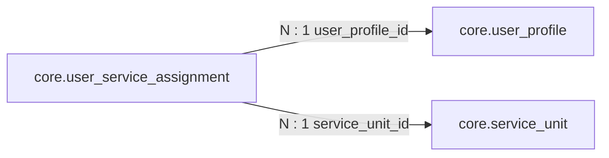

# `core` Schema — Users and Service Units

Created by [`001_core.sql`](../../apps/api/migrations/001_core.sql); the
`service_unit.kind` list was extended in
[`006_tea_cafe.sql`](../../apps/api/migrations/006_tea_cafe.sql).

These tables are the hubs of the whole database. Almost every other table
references `core.user_profile` (who owns / who acted) or `core.service_unit`
(which service the row belongs to).

## Relationships

```text
core.user_service_assignment.user_profile_id  ──►  core.user_profile.id   (N : 1)
core.user_service_assignment.service_unit_id  ──►  core.service_unit.id   (N : 1)
```



`user_service_assignment` is a many-to-many bridge: one user can have several
roles in several service units, and one service unit can have many users.

```text
core.user_profile  ◄──  core.user_service_assignment  ──►  core.service_unit
        1         N                                    N          1
```

### Incoming references from other schemas

```text
wallet.account.user_profile_id                   ──►  core.user_profile.id   (1 : 1)
wallet.ledger_entry.actor_user_profile_id        ──►  core.user_profile.id   (N : 0..1)
canteen.product_event.actor_user_profile_id      ──►  core.user_profile.id   (N : 1)
canteen.customer_order.customer_user_profile_id  ──►  core.user_profile.id   (N : 1)
canteen.order_event.actor_user_profile_id        ──►  core.user_profile.id   (N : 1)
tea_cafe.brew.created_by_user_profile_id         ──►  core.user_profile.id   (N : 1)
tea_cafe.brew.deleted_by_user_profile_id         ──►  core.user_profile.id   (N : 0..1)
laundry.tariff.updated_by_user_profile_id        ──►  core.user_profile.id   (N : 0..1)
laundry.load.owner_user_profile_id               ──►  core.user_profile.id   (N : 1)
laundry.load.created_by_user_profile_id          ──►  core.user_profile.id   (N : 1)
laundry.machine_run.started_by_user_profile_id   ──►  core.user_profile.id   (N : 1)
laundry.machine_run.removed_by_user_profile_id   ──►  core.user_profile.id   (N : 0..1)
laundry.load_event.actor_user_profile_id         ──►  core.user_profile.id   (N : 1)

canteen.store.service_unit_id                    ──►  core.service_unit.id   (1 : 1)
tea_cafe.brew.service_unit_id                    ──►  core.service_unit.id   (N : 1)
laundry.tariff.service_unit_id                   ──►  core.service_unit.id   (1 : 1)
laundry.load.service_unit_id                     ──►  core.service_unit.id   (N : 1)

wallet.ledger_entry.service_code                 ┄┄►  core.service_unit.code (logical, no FK)
```

---

## `core.user_profile`

Application-side profile of a person who signs in through Keycloak.

| Column             | Type          | Null | Default             | Constraints / notes                                 |
| ------------------ | ------------- | ---- | ------------------- | --------------------------------------------------- |
| `id`               | `uuid`        | no   | `gen_random_uuid()` | **PK**                                              |
| `keycloak_subject` | `uuid`        | no   |                     | `UNIQUE`; the `sub` claim of the Keycloak token     |
| `phone_e164`       | `text`        | no   |                     | `UNIQUE`; must match `^\+[1-9][0-9]{7,14}$` (E.164) |
| `first_name`       | `text`        | no   |                     | must not be blank                                   |
| `last_name`        | `text`        | no   |                     | must not be blank                                   |
| `status`           | `text`        | no   | `'ACTIVE'`          | `ACTIVE`, `SUSPENDED`, `DEPARTED`                   |
| `created_at`       | `timestamptz` | no   | `now()`             |                                                     |
| `updated_at`       | `timestamptz` | no   | `now()`             |                                                     |

**Triggers**

| Trigger                            | When                | Effect                                                                                 |
| ---------------------------------- | ------------------- | -------------------------------------------------------------------------------------- |
| `create_wallet_account_after_user` | `AFTER INSERT`, row | Calls `wallet.create_account_for_user()`, which inserts the matching `wallet.account`. |

Because of this trigger every user profile always has exactly one wallet
account.

---

## `core.service_unit`

A physical service the organisation operates (canteen, laundry, tea & cafe…).

| Column       | Type          | Null | Default             | Constraints / notes                         |
| ------------ | ------------- | ---- | ------------------- | ------------------------------------------- |
| `id`         | `uuid`        | no   | `gen_random_uuid()` | **PK**                                      |
| `code`       | `text`        | no   |                     | `UNIQUE`; stable machine-readable code      |
| `name`       | `text`        | no   |                     | Display name                                |
| `kind`       | `text`        | no   |                     | `CANTEEN`, `LAUNDRY`, `KITCHEN`, `TEA_CAFE` |
| `active`     | `boolean`     | no   | `true`              |                                             |
| `created_at` | `timestamptz` | no   | `now()`             |                                             |

**Seeded rows**

| `code`          | `name`      | `kind`     | Seeded by          |
| --------------- | ----------- | ---------- | ------------------ |
| `canteen-main`  | Ana Kantin  | `CANTEEN`  | `001_core.sql`     |
| `tea-cafe-main` | Tea & Cafe  | `TEA_CAFE` | `006_tea_cafe.sql` |
| `laundry-main`  | Çamaşırhane | `LAUNDRY`  | `007_laundry.sql`  |

The `code` values are also written into `wallet.ledger_entry.service_code`.

---

## `core.user_service_assignment`

Bridge table that assigns a role to a user inside a service unit.

| Column            | Type          | Null | Default | Constraints / notes                            |
| ----------------- | ------------- | ---- | ------- | ---------------------------------------------- |
| `user_profile_id` | `uuid`        | no   |         | **PK (part)**, **FK** → `core.user_profile.id` |
| `service_unit_id` | `uuid`        | no   |         | **PK (part)**, **FK** → `core.service_unit.id` |
| `role_code`       | `text`        | no   |         | **PK (part)**; free text role name             |
| `created_at`      | `timestamptz` | no   | `now()` |                                                |

Primary key: `(user_profile_id, service_unit_id, role_code)`.

> [!NOTE]
> The current API modules do not read or write this table. Authorization roles
> (`laundry_manager`, `laundry_operator`, …) come from Keycloak token claims.
> The table is reserved for per-unit role assignment.
