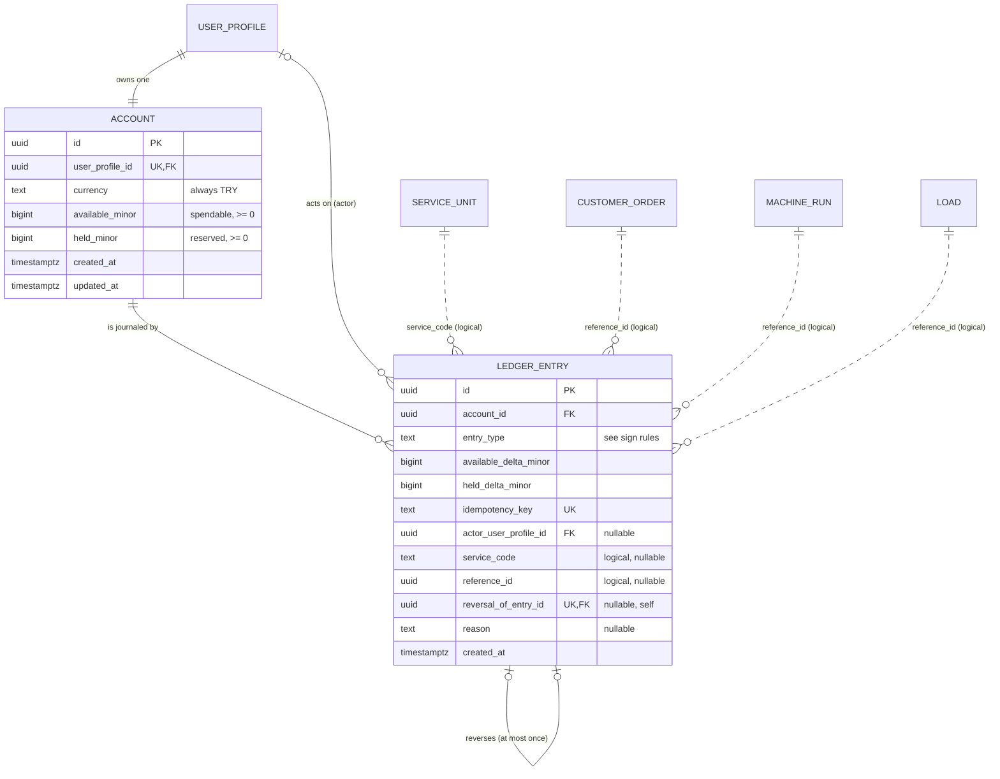
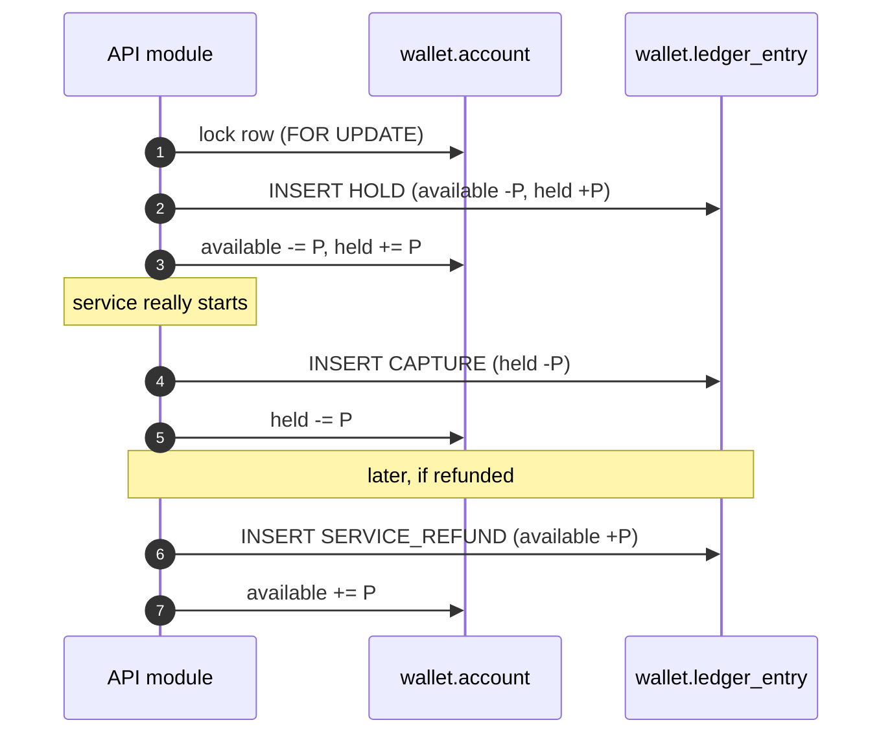

# `wallet` Schema — Accounts and Ledger

Created by [`002_wallet.sql`](../../apps/api/migrations/002_wallet.sql).

Every user has one TRY wallet. Balances live on `wallet.account`; every change
to a balance is recorded as an immutable row in `wallet.ledger_entry`.

## At a glance

| Table                 | Role                   | Mutability                         | Key idea                                        |
| --------------------- | ---------------------- | ---------------------------------- | ----------------------------------------------- |
| `wallet.account`      | **Entity** – a balance | updated only by the API in a tx    | one row per user: `available` + `held` in kuruş |
| `wallet.ledger_entry` | **Event** – a journal  | **append-only** (trigger-enforced) | every balance change, with a reason and a trace |

**Design principle – double bookkeeping lite.** The balance on `account` is a
cache of the ledger. If the two ever disagree, the ledger is the truth.

**Why `available` and `held`?** A service charge is a two-step operation. The
money is first _held_ (reserved, so it cannot be spent twice) and only then
_captured_ (consumed) once the service is really started. A failure between the
steps can `RELEASE` the hold without losing money.

## Entity–relationship diagram

Notation: `PK` primary key, `FK` foreign key, `UK` unique key. Dotted
relationships are **logical** (no database foreign key).



### Reading the diagram

| Relationship                               | Cardinality | Meaning                                                                     |
| ------------------------------------------ | ----------- | --------------------------------------------------------------------------- |
| `user_profile` → `account`                 | 1 : 1       | Exactly one wallet per user (created by a trigger).                         |
| `account` → `ledger_entry`                 | 1 : N       | An account's history is the list of its entries.                            |
| `user_profile` → `ledger_entry` (actor)    | 1 : N (opt) | Who performed the action; `NULL` for system-initiated entries.              |
| `ledger_entry` → `ledger_entry` (reversal) | 1 : 0..1    | A correction points at the entry it cancels; `UNIQUE` ⇒ reversed only once. |

| Child column (holds the reference)          | Referenced column        | Cardinality / note          | Type        |
| ------------------------------------------- | ------------------------ | --------------------------- | ----------- |
| `wallet.account.user_profile_id`            | `core.user_profile.id`   | 1 : 1                       | Foreign key |
| `wallet.ledger_entry.account_id`            | `wallet.account.id`      | N : 1                       | Foreign key |
| `wallet.ledger_entry.actor_user_profile_id` | `core.user_profile.id`   | N : 0..1                    | Foreign key |
| `wallet.ledger_entry.reversal_of_entry_id`  | `wallet.ledger_entry.id` | 0..1 : 0..1, self reference | Foreign key |

### Logical references (no foreign key)

The ledger is shared by several services, so it cannot have a real FK to each
service table. Instead `service_code` tells you _which table_ `reference_id`
points to:

| `service_code` | Entry types                             | `reference_id` points to    | Granularity           |
| -------------- | --------------------------------------- | --------------------------- | --------------------- |
| `canteen-main` | `HOLD`, `CAPTURE`, `SERVICE_REFUND`     | `canteen.customer_order.id` | one order             |
| `laundry-main` | `HOLD`, `CAPTURE`                       | `laundry.machine_run.id`    | one wash / dry run    |
| `laundry-main` | `SERVICE_REFUND`                        | `laundry.load.id`           | the whole load        |
| `NULL`         | `CASH_DEPOSIT`, `CASH_DEPOSIT_REVERSAL` | `NULL`                      | not tied to a service |

`service_code` itself is a logical link to `core.service_unit.code`.

### How a service charge flows



Each insert carries an `idempotency_key`; replaying the same request hits the
`UNIQUE` constraint instead of charging twice.

---

## `wallet.account`

One balance row per user. Created automatically by the
`create_wallet_account_after_user` trigger on `core.user_profile`.

| Column            | Type          | Null | Default             | Constraints / notes                                 |
| ----------------- | ------------- | ---- | ------------------- | --------------------------------------------------- |
| `id`              | `uuid`        | no   | `gen_random_uuid()` | **PK**                                              |
| `user_profile_id` | `uuid`        | no   |                     | `UNIQUE`, **FK** → `core.user_profile.id`           |
| `currency`        | `text`        | no   | `'TRY'`             | must equal `'TRY'`                                  |
| `available_minor` | `bigint`      | no   | `0`                 | `>= 0`; spendable balance in kuruş                  |
| `held_minor`      | `bigint`      | no   | `0`                 | `>= 0`; amount reserved by a pending service charge |
| `created_at`      | `timestamptz` | no   | `now()`             |                                                     |
| `updated_at`      | `timestamptz` | no   | `now()`             |                                                     |

The balances are a running total of the ledger:

```text
available_minor = Σ ledger_entry.available_delta_minor
held_minor      = Σ ledger_entry.held_delta_minor
```

---

## `wallet.ledger_entry`

Append-only journal of every balance change.

| Column                  | Type          | Null | Default             | Constraints / notes                                       |
| ----------------------- | ------------- | ---- | ------------------- | --------------------------------------------------------- |
| `id`                    | `uuid`        | no   | `gen_random_uuid()` | **PK**                                                    |
| `account_id`            | `uuid`        | no   |                     | **FK** → `wallet.account.id`                              |
| `entry_type`            | `text`        | no   |                     | see table below                                           |
| `available_delta_minor` | `bigint`      | no   |                     | change applied to `account.available_minor`               |
| `held_delta_minor`      | `bigint`      | no   | `0`                 | change applied to `account.held_minor`                    |
| `idempotency_key`       | `text`        | no   |                     | `UNIQUE`; 8–200 characters                                |
| `actor_user_profile_id` | `uuid`        | yes  |                     | **FK** → `core.user_profile.id`; who performed the action |
| `service_code`          | `text`        | yes  |                     | logical link to `core.service_unit.code`                  |
| `reference_id`          | `uuid`        | yes  |                     | logical link to the service record (order, run, load)     |
| `reversal_of_entry_id`  | `uuid`        | yes  |                     | `UNIQUE`, **FK** → `wallet.ledger_entry.id`               |
| `reason`                | `text`        | yes  |                     | 3–500 characters when present                             |
| `created_at`            | `timestamptz` | no   | `now()`             |                                                           |

### Entry types and their sign rules

The table-level `CHECK` constraint enforces these combinations:

| `entry_type`            | `available_delta_minor` | `held_delta_minor` | Extra rule                                         |
| ----------------------- | ----------------------- | ------------------ | -------------------------------------------------- |
| `CASH_DEPOSIT`          | `> 0`                   | `= 0`              | `reversal_of_entry_id IS NULL`                     |
| `CASH_DEPOSIT_REVERSAL` | `< 0`                   | `= 0`              | `reversal_of_entry_id` **and** `reason` required   |
| `HOLD`                  | `< 0`                   | `> 0`              | the two deltas sum to `0` (money moves to held)    |
| `CAPTURE`               | `= 0`                   | `< 0`              | held money is consumed                             |
| `RELEASE`               | `> 0`                   | `< 0`              | the two deltas sum to `0` (held money is returned) |
| `SERVICE_REFUND`        | `> 0`                   | `= 0`              | money returned after a captured service            |

### Typical flows

| Scenario           | Entries written (in order)                        | Linked by                                     |
| ------------------ | ------------------------------------------------- | --------------------------------------------- |
| Cash deposit       | `CASH_DEPOSIT` (+available)                       | –                                             |
| Deposit correction | `CASH_DEPOSIT_REVERSAL` (-available)              | `reversal_of_entry_id` → the original deposit |
| Service charge     | `HOLD` (available → held), then `CAPTURE` (-held) | same `service_code` + `reference_id`          |
| Service refund     | `SERVICE_REFUND` (+available)                     | `service_code` + `reference_id`               |

`reversal_of_entry_id` is `UNIQUE`, so a deposit can be reversed at most once.

### Indexes

| Index                              | Columns                                    | Notes                                        |
| ---------------------------------- | ------------------------------------------ | -------------------------------------------- |
| `ledger_entry_account_created_idx` | `(account_id, created_at DESC, id DESC)`   | account statement                            |
| `ledger_entry_actor_created_idx`   | `(actor_user_profile_id, created_at DESC)` | partial: `actor_user_profile_id IS NOT NULL` |

### Triggers

| Trigger                  | When                           | Effect                                       |
| ------------------------ | ------------------------------ | -------------------------------------------- |
| `ledger_entry_immutable` | `BEFORE UPDATE OR DELETE`, row | raises `wallet ledger entries are immutable` |
