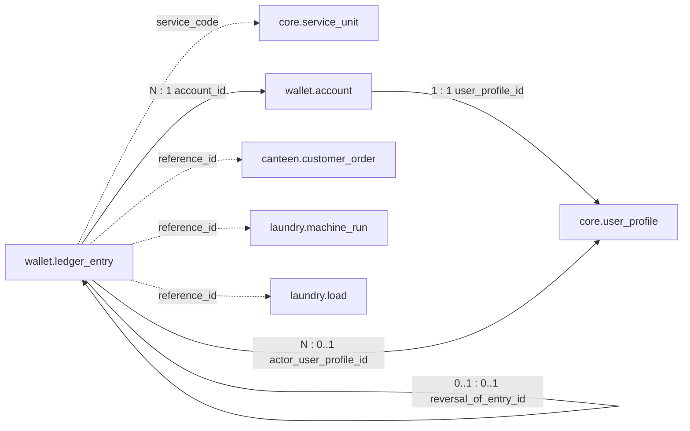

# `wallet` Schema — Accounts and Ledger

Created by [`002_wallet.sql`](../../apps/api/migrations/002_wallet.sql).

Every user has one TRY wallet. Balances live on `wallet.account`; every change
to a balance is recorded as an immutable row in `wallet.ledger_entry`.

## Relationships

```text
wallet.account.user_profile_id             ──►  core.user_profile.id        (1 : 1)
wallet.ledger_entry.account_id             ──►  wallet.account.id           (N : 1)
wallet.ledger_entry.actor_user_profile_id  ──►  core.user_profile.id        (N : 0..1)
wallet.ledger_entry.reversal_of_entry_id   ──►  wallet.ledger_entry.id      (0..1 : 0..1, self reference)
```

Logical references (plain columns, **no** foreign key):

```text
wallet.ledger_entry.service_code  ┄┄►  core.service_unit.code
wallet.ledger_entry.reference_id  ┄┄►  canteen.customer_order.id   when service_code = 'canteen-main'
wallet.ledger_entry.reference_id  ┄┄►  laundry.machine_run.id      when service_code = 'laundry-main' and entry is HOLD / CAPTURE
wallet.ledger_entry.reference_id  ┄┄►  laundry.load.id             when service_code = 'laundry-main' and entry is SERVICE_REFUND
```



Ownership chain of a ledger row:

```text
wallet.ledger_entry  ──►  wallet.account  ──►  core.user_profile
```

---

## `wallet.account`

One balance row per user. Created automatically by the
`create_wallet_account_after_user` trigger on `core.user_profile`.

| Column            | Type          | Null | Default             | Constraints / notes                                 |
| ----------------- | ------------- | ---- | ------------------- | --------------------------------------------------- |
| `id`              | `uuid`        | no   | `gen_random_uuid()` | **PK**                                              |
| `user_profile_id` | `uuid`        | no   |                     | `UNIQUE`, **FK** → `core.user_profile.id`           |
| `currency`        | `text`        | no   | `'TRY'`             | must equal `'TRY'`                                  |
| `available_minor` | `bigint`      | no   | `0`                 | `>= 0`; spendable balance in kuruş                  |
| `held_minor`      | `bigint`      | no   | `0`                 | `>= 0`; amount reserved by a pending service charge |
| `created_at`      | `timestamptz` | no   | `now()`             |                                                     |
| `updated_at`      | `timestamptz` | no   | `now()`             |                                                     |

The balances are a running total of the ledger:

```text
available_minor = Σ ledger_entry.available_delta_minor
held_minor      = Σ ledger_entry.held_delta_minor
```

---

## `wallet.ledger_entry`

Append-only journal of every balance change.

| Column                  | Type          | Null | Default             | Constraints / notes                                       |
| ----------------------- | ------------- | ---- | ------------------- | --------------------------------------------------------- |
| `id`                    | `uuid`        | no   | `gen_random_uuid()` | **PK**                                                    |
| `account_id`            | `uuid`        | no   |                     | **FK** → `wallet.account.id`                              |
| `entry_type`            | `text`        | no   |                     | see table below                                           |
| `available_delta_minor` | `bigint`      | no   |                     | change applied to `account.available_minor`               |
| `held_delta_minor`      | `bigint`      | no   | `0`                 | change applied to `account.held_minor`                    |
| `idempotency_key`       | `text`        | no   |                     | `UNIQUE`; 8–200 characters                                |
| `actor_user_profile_id` | `uuid`        | yes  |                     | **FK** → `core.user_profile.id`; who performed the action |
| `service_code`          | `text`        | yes  |                     | logical link to `core.service_unit.code`                  |
| `reference_id`          | `uuid`        | yes  |                     | logical link to the service record (order, run, load)     |
| `reversal_of_entry_id`  | `uuid`        | yes  |                     | `UNIQUE`, **FK** → `wallet.ledger_entry.id`               |
| `reason`                | `text`        | yes  |                     | 3–500 characters when present                             |
| `created_at`            | `timestamptz` | no   | `now()`             |                                                           |

### Entry types and their sign rules

The table-level `CHECK` constraint enforces these combinations:

| `entry_type`            | `available_delta_minor` | `held_delta_minor` | Extra rule                                         |
| ----------------------- | ----------------------- | ------------------ | -------------------------------------------------- |
| `CASH_DEPOSIT`          | `> 0`                   | `= 0`              | `reversal_of_entry_id IS NULL`                     |
| `CASH_DEPOSIT_REVERSAL` | `< 0`                   | `= 0`              | `reversal_of_entry_id` **and** `reason` required   |
| `HOLD`                  | `< 0`                   | `> 0`              | the two deltas sum to `0` (money moves to held)    |
| `CAPTURE`               | `= 0`                   | `< 0`              | held money is consumed                             |
| `RELEASE`               | `> 0`                   | `< 0`              | the two deltas sum to `0` (held money is returned) |
| `SERVICE_REFUND`        | `> 0`                   | `= 0`              | money returned after a captured service            |

### Typical flows

```text
Cash deposit        CASH_DEPOSIT (+available)
Deposit correction  CASH_DEPOSIT_REVERSAL (-available) ──reversal_of_entry_id──► CASH_DEPOSIT
Service charge      HOLD (available → held)  then  CAPTURE (-held)      same service_code + reference_id
Service refund      SERVICE_REFUND (+available)
```

`reversal_of_entry_id` is `UNIQUE`, so a deposit can be reversed at most once.

### Indexes

| Index                              | Columns                                    | Notes                                        |
| ---------------------------------- | ------------------------------------------ | -------------------------------------------- |
| `ledger_entry_account_created_idx` | `(account_id, created_at DESC, id DESC)`   | account statement                            |
| `ledger_entry_actor_created_idx`   | `(actor_user_profile_id, created_at DESC)` | partial: `actor_user_profile_id IS NOT NULL` |

### Triggers

| Trigger                  | When                           | Effect                                       |
| ------------------------ | ------------------------------ | -------------------------------------------- |
| `ledger_entry_immutable` | `BEFORE UPDATE OR DELETE`, row | raises `wallet ledger entries are immutable` |
