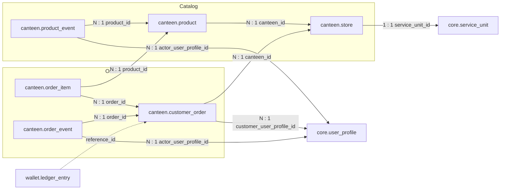

# `canteen` Schema — Store, Catalog and Orders

Created by
[`003_canteen_catalog.sql`](../../apps/api/migrations/003_canteen_catalog.sql)
and [`004_canteen_orders.sql`](../../apps/api/migrations/004_canteen_orders.sql);
the order workflow was simplified by
[`005_simplify_canteen_orders.sql`](../../apps/api/migrations/005_simplify_canteen_orders.sql).

The tables form two groups that meet at `canteen.product`:

- **Catalog:** `store`, `product`, `product_event`
- **Orders:** `customer_order`, `order_item`, `order_event`

## Relationships

```text
canteen.store.service_unit_id                    ──►  core.service_unit.id       (1 : 1)

canteen.product.canteen_id                       ──►  canteen.store.id           (N : 1)
canteen.product_event.product_id                 ──►  canteen.product.id         (N : 1)
canteen.product_event.actor_user_profile_id      ──►  core.user_profile.id       (N : 1)

canteen.customer_order.canteen_id                ──►  canteen.store.id           (N : 1)
canteen.customer_order.customer_user_profile_id  ──►  core.user_profile.id       (N : 1)
canteen.order_item.order_id                      ──►  canteen.customer_order.id  (N : 1)
canteen.order_item.product_id                    ──►  canteen.product.id         (N : 1)
canteen.order_event.order_id                     ──►  canteen.customer_order.id  (N : 1)
canteen.order_event.actor_user_profile_id        ──►  core.user_profile.id       (N : 1)
```

Incoming logical reference:

```text
wallet.ledger_entry.reference_id  ┄┄►  canteen.customer_order.id   (service_code = 'canteen-main')
```



`order_item` is the many-to-many bridge between orders and products:

```text
canteen.customer_order  ◄──  canteen.order_item  ──►  canteen.product
          1            N                        N           1
```

---

## Catalog group

### `canteen.store`

Canteen-specific settings for a `CANTEEN` service unit.

| Column             | Type          | Null | Default             | Constraints / notes                              |
| ------------------ | ------------- | ---- | ------------------- | ------------------------------------------------ |
| `id`               | `uuid`        | no   | `gen_random_uuid()` | **PK**                                           |
| `service_unit_id`  | `uuid`        | no   |                     | `UNIQUE`, **FK** → `core.service_unit.id`        |
| `customer_visible` | `boolean`     | no   | `false`             | at most one store may be `true` (partial unique) |
| `ordering_enabled` | `boolean`     | no   | `false`             | customers can place orders when `true`           |
| `created_at`       | `timestamptz` | no   | `now()`             |                                                  |
| `updated_at`       | `timestamptz` | no   | `now()`             |                                                  |

| Index                                 | Columns              | Notes                                       |
| ------------------------------------- | -------------------- | ------------------------------------------- |
| `canteen_single_customer_visible_idx` | `(customer_visible)` | `UNIQUE`, partial: `WHERE customer_visible` |

A store row is seeded for every `CANTEEN` service unit; `canteen-main` is the
customer-visible one.

### `canteen.product`

| Column           | Type          | Null | Default             | Constraints / notes                                                |
| ---------------- | ------------- | ---- | ------------------- | ------------------------------------------------------------------ |
| `id`             | `uuid`        | no   | `gen_random_uuid()` | **PK**                                                             |
| `canteen_id`     | `uuid`        | no   |                     | **FK** → `canteen.store.id`                                        |
| `name`           | `text`        | no   |                     | 1–120 characters after trim                                        |
| `name_key`       | `text`        | no   |                     | normalised name, 1–120 characters; `UNIQUE (canteen_id, name_key)` |
| `price_minor`    | `bigint`      | no   |                     | `> 0` and whole lira (`% 100 = 0`)                                 |
| `stock_on_hand`  | `bigint`      | no   | `0`                 | `>= 0`                                                             |
| `stock_reserved` | `bigint`      | no   | `0`                 | `>= 0` and `<= stock_on_hand`                                      |
| `listed`         | `boolean`     | no   | `true`              | shown in the customer catalog                                      |
| `archived_at`    | `timestamptz` | yes  |                     | soft delete                                                        |
| `created_at`     | `timestamptz` | no   | `now()`             |                                                                    |
| `updated_at`     | `timestamptz` | no   | `now()`             |                                                                    |

| Index                                  | Columns                  | Notes                                     |
| -------------------------------------- | ------------------------ | ----------------------------------------- |
| `UNIQUE (canteen_id, name_key)`        | `(canteen_id, name_key)` | no duplicate product names per store      |
| `canteen_product_customer_catalog_idx` | `(canteen_id, name)`     | partial: `archived_at IS NULL AND listed` |

### `canteen.product_event`

Immutable audit trail of catalog changes.

| Column                  | Type          | Null | Default             | Constraints / notes                                                                |
| ----------------------- | ------------- | ---- | ------------------- | ---------------------------------------------------------------------------------- |
| `id`                    | `uuid`        | no   | `gen_random_uuid()` | **PK**                                                                             |
| `product_id`            | `uuid`        | no   |                     | **FK** → `canteen.product.id`                                                      |
| `event_type`            | `text`        | no   |                     | `CREATED`, `UPDATED`, `STOCK_SET`, `LISTED`, `UNLISTED`, `ARCHIVED`, `REACTIVATED` |
| `actor_user_profile_id` | `uuid`        | no   |                     | **FK** → `core.user_profile.id`                                                    |
| `before_state`          | `jsonb`       | yes  |                     | product snapshot before the change (`NULL` for `CREATED`)                          |
| `after_state`           | `jsonb`       | no   |                     | product snapshot after the change                                                  |
| `created_at`            | `timestamptz` | no   | `now()`             |                                                                                    |

| Index / trigger                             | Definition                                  |
| ------------------------------------------- | ------------------------------------------- |
| `canteen_product_event_product_created_idx` | `(product_id, created_at DESC, id DESC)`    |
| `product_event_immutable` (trigger)         | `BEFORE UPDATE OR DELETE` → raises an error |

---

## Orders group

### `canteen.customer_order`

| Column                     | Type          | Null | Default             | Constraints / notes                                                              |
| -------------------------- | ------------- | ---- | ------------------- | -------------------------------------------------------------------------------- |
| `id`                       | `uuid`        | no   | `gen_random_uuid()` | **PK**                                                                           |
| `canteen_id`               | `uuid`        | no   |                     | **FK** → `canteen.store.id`                                                      |
| `customer_user_profile_id` | `uuid`        | no   |                     | **FK** → `core.user_profile.id`                                                  |
| `status`                   | `text`        | no   | `'PLACED'`          | `PLACED`, `PREPARING`, `READY`, `DELIVERED`, `CANCELLED`, `CANCELLED_BY_CANTEEN` |
| `total_minor`              | `bigint`      | no   |                     | `> 0`; sum of the order's `line_total_minor`                                     |
| `idempotency_key`          | `text`        | no   |                     | `UNIQUE`; 8–200 characters                                                       |
| `created_at`               | `timestamptz` | no   | `now()`             |                                                                                  |
| `updated_at`               | `timestamptz` | no   | `now()`             |                                                                                  |

> [!NOTE]
> Migration `004` originally also had `ACCEPTED` / `REJECTED` statuses and a
> six-digit `delivery_code`. Migration `005` removed them: orders are now
> captured from the wallet immediately when placed.

| Index                                       | Columns                                                |
| ------------------------------------------- | ------------------------------------------------------ |
| `customer_order_customer_created_idx`       | `(customer_user_profile_id, created_at DESC, id DESC)` |
| `customer_order_canteen_status_created_idx` | `(canteen_id, status, created_at, id)`                 |

Wallet link: placing an order writes a `HOLD` + `CAPTURE` pair, and a refund
writes a `SERVICE_REFUND`, all with `service_code = 'canteen-main'` and
`reference_id = customer_order.id`.

### `canteen.order_item`

Immutable line items with name and price snapshots taken at order time.

| Column             | Type     | Null | Default             | Constraints / notes                       |
| ------------------ | -------- | ---- | ------------------- | ----------------------------------------- |
| `id`               | `uuid`   | no   | `gen_random_uuid()` | **PK**                                    |
| `order_id`         | `uuid`   | no   |                     | **FK** → `canteen.customer_order.id`      |
| `product_id`       | `uuid`   | no   |                     | **FK** → `canteen.product.id`             |
| `product_name`     | `text`   | no   |                     | snapshot; 1–120 characters                |
| `unit_price_minor` | `bigint` | no   |                     | snapshot; `> 0`                           |
| `quantity`         | `bigint` | no   |                     | `> 0`                                     |
| `line_total_minor` | `bigint` | no   |                     | `> 0` and `= unit_price_minor * quantity` |

| Index / constraint / trigger     | Definition                                  |
| -------------------------------- | ------------------------------------------- |
| `UNIQUE (order_id, product_id)`  | a product appears once per order            |
| `order_item_order_idx`           | `(order_id)`                                |
| `order_item_immutable` (trigger) | `BEFORE UPDATE OR DELETE` → raises an error |

### `canteen.order_event`

Immutable status-transition history of an order.

| Column                  | Type          | Null | Default             | Constraints / notes                  |
| ----------------------- | ------------- | ---- | ------------------- | ------------------------------------ |
| `id`                    | `uuid`        | no   | `gen_random_uuid()` | **PK**                               |
| `order_id`              | `uuid`        | no   |                     | **FK** → `canteen.customer_order.id` |
| `from_status`           | `text`        | yes  |                     | `NULL` for the creation event        |
| `to_status`             | `text`        | no   |                     |                                      |
| `actor_user_profile_id` | `uuid`        | no   |                     | **FK** → `core.user_profile.id`      |
| `created_at`            | `timestamptz` | no   | `now()`             |                                      |

| Trigger                 | Definition                                  |
| ----------------------- | ------------------------------------------- |
| `order_event_immutable` | `BEFORE UPDATE OR DELETE` → raises an error |
