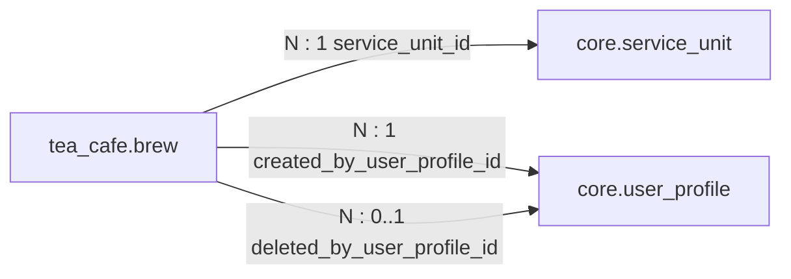

# `tea_cafe` Schema — Brew Timers

Created by [`006_tea_cafe.sql`](../../apps/api/migrations/006_tea_cafe.sql),
which also seeds the `tea-cafe-main` service unit and adds `TEA_CAFE` to
`core.service_unit.kind`.

A brew is a timed record of a pot of tea or coffee: when it was started and
when it will be ready. It has no wallet interaction.

## Relationships

```text
tea_cafe.brew.service_unit_id             ──►  core.service_unit.id   (N : 1)
tea_cafe.brew.created_by_user_profile_id  ──►  core.user_profile.id   (N : 1)
tea_cafe.brew.deleted_by_user_profile_id  ──►  core.user_profile.id   (N : 0..1)
```



---

## `tea_cafe.brew`

| Column                       | Type          | Null | Default             | Constraints / notes                                |
| ---------------------------- | ------------- | ---- | ------------------- | -------------------------------------------------- |
| `id`                         | `uuid`        | no   | `gen_random_uuid()` | **PK**                                             |
| `service_unit_id`            | `uuid`        | no   |                     | **FK** → `core.service_unit.id`                    |
| `beverage_type`              | `text`        | no   |                     | `TEA`, `COFFEE`                                    |
| `note`                       | `text`        | yes  |                     | 1–80 characters after trim when present            |
| `duration_minutes`           | `integer`     | no   |                     | 1–180; **must be 21 when `beverage_type = 'TEA'`** |
| `started_at`                 | `timestamptz` | no   | `now()`             |                                                    |
| `ready_at`                   | `timestamptz` | no   |                     | must be later than `started_at`                    |
| `created_by_user_profile_id` | `uuid`        | no   |                     | **FK** → `core.user_profile.id`                    |
| `deleted_at`                 | `timestamptz` | yes  |                     | soft delete                                        |
| `deleted_by_user_profile_id` | `uuid`        | yes  |                     | **FK** → `core.user_profile.id`                    |

### Check constraints

| Rule                                                                  | Purpose                         |
| --------------------------------------------------------------------- | ------------------------------- |
| `beverage_type <> 'TEA' OR duration_minutes = 21`                     | tea always brews for 21 minutes |
| `ready_at > started_at`                                               | ready time is in the future     |
| `deleted_at` and `deleted_by_user_profile_id` both `NULL` or both set | soft delete always records who  |

### Indexes

| Index                             | Columns                           | Notes                         |
| --------------------------------- | --------------------------------- | ----------------------------- |
| `tea_cafe_brew_visible_ready_idx` | `(service_unit_id, ready_at, id)` | partial: `deleted_at IS NULL` |
