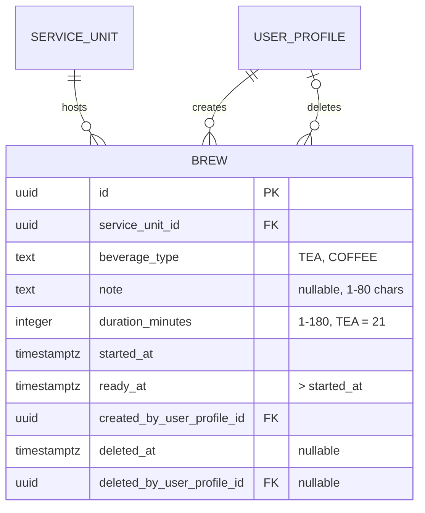
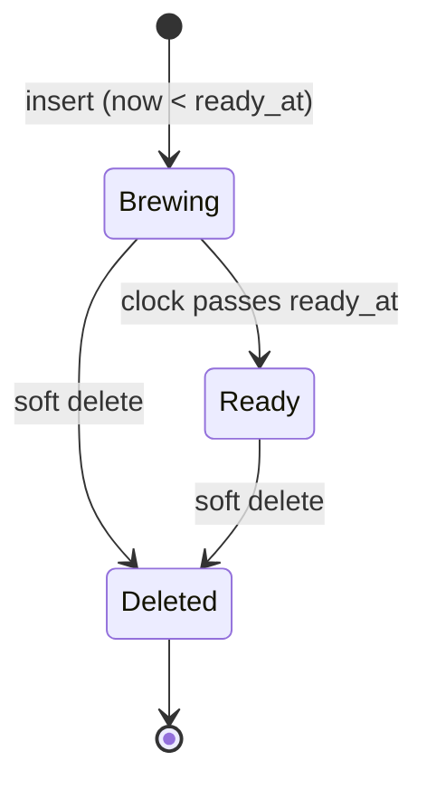

# `tea_cafe` Schema — Brew Timers

Created by [`006_tea_cafe.sql`](../../apps/api/migrations/006_tea_cafe.sql),
which also seeds the `tea-cafe-main` service unit and adds `TEA_CAFE` to
`core.service_unit.kind`.

A brew is a timed record of a pot of tea or coffee: when it was started and
when it will be ready. It has no wallet interaction.

## At a glance

| Table           | Role                     | Mutability                  | Key idea                                    |
| --------------- | ------------------------ | --------------------------- | ------------------------------------------- |
| `tea_cafe.brew` | **Entity** – a timed pot | soft-deleted, never updated | a countdown from `started_at` to `ready_at` |

The schema is intentionally tiny: one table, no wallet interaction, no event
table. Deleting a brew only sets `deleted_at` / `deleted_by_user_profile_id`,
so the "who removed it" information is kept on the row itself.

## Entity–relationship diagram

Notation: `PK` primary key, `FK` foreign key. `||` exactly one, `o|` zero or
one, `o{` zero or many.

### Reading the diagram

| Relationship                      | Cardinality | Meaning                                                             |
| --------------------------------- | ----------- | ------------------------------------------------------------------- |
| `service_unit` → `brew`           | 1 : N       | A tea & cafe unit hosts many brews over time.                       |
| `user_profile` → `brew` (creator) | 1 : N       | Every brew records who started it (mandatory).                      |
| `user_profile` → `brew` (deleter) | 1 : 0..N    | Set together with `deleted_at`; both `NULL` while the brew is live. |

| Child column (holds the reference)         | Referenced column      | Cardinality / note | Type        |
| ------------------------------------------ | ---------------------- | ------------------ | ----------- |
| `tea_cafe.brew.service_unit_id`            | `core.service_unit.id` | N : 1              | Foreign key |
| `tea_cafe.brew.created_by_user_profile_id` | `core.user_profile.id` | N : 1              | Foreign key |
| `tea_cafe.brew.deleted_by_user_profile_id` | `core.user_profile.id` | N : 0..1           | Foreign key |

### Brew lifecycle

> [!NOTE]
> `Brewing` and `Ready` are **derived** from `now()` versus `ready_at`; there is
> no status column. Only `Deleted` is stored (`deleted_at IS NOT NULL`).

---

## `tea_cafe.brew`

| Column                       | Type          | Null | Default             | Constraints / notes                                |
| ---------------------------- | ------------- | ---- | ------------------- | -------------------------------------------------- |
| `id`                         | `uuid`        | no   | `gen_random_uuid()` | **PK**                                             |
| `service_unit_id`            | `uuid`        | no   |                     | **FK** → `core.service_unit.id`                    |
| `beverage_type`              | `text`        | no   |                     | `TEA`, `COFFEE`                                    |
| `note`                       | `text`        | yes  |                     | 1–80 characters after trim when present            |
| `duration_minutes`           | `integer`     | no   |                     | 1–180; **must be 21 when `beverage_type = 'TEA'`** |
| `started_at`                 | `timestamptz` | no   | `now()`             |                                                    |
| `ready_at`                   | `timestamptz` | no   |                     | must be later than `started_at`                    |
| `created_by_user_profile_id` | `uuid`        | no   |                     | **FK** → `core.user_profile.id`                    |
| `deleted_at`                 | `timestamptz` | yes  |                     | soft delete                                        |
| `deleted_by_user_profile_id` | `uuid`        | yes  |                     | **FK** → `core.user_profile.id`                    |

### Check constraints

| Rule                                                                  | Purpose                         |
| --------------------------------------------------------------------- | ------------------------------- |
| `beverage_type <> 'TEA' OR duration_minutes = 21`                     | tea always brews for 21 minutes |
| `ready_at > started_at`                                               | ready time is in the future     |
| `deleted_at` and `deleted_by_user_profile_id` both `NULL` or both set | soft delete always records who  |

### Indexes

| Index                             | Columns                           | Notes                         |
| --------------------------------- | --------------------------------- | ----------------------------- |
| `tea_cafe_brew_visible_ready_idx` | `(service_unit_id, ready_at, id)` | partial: `deleted_at IS NULL` |
