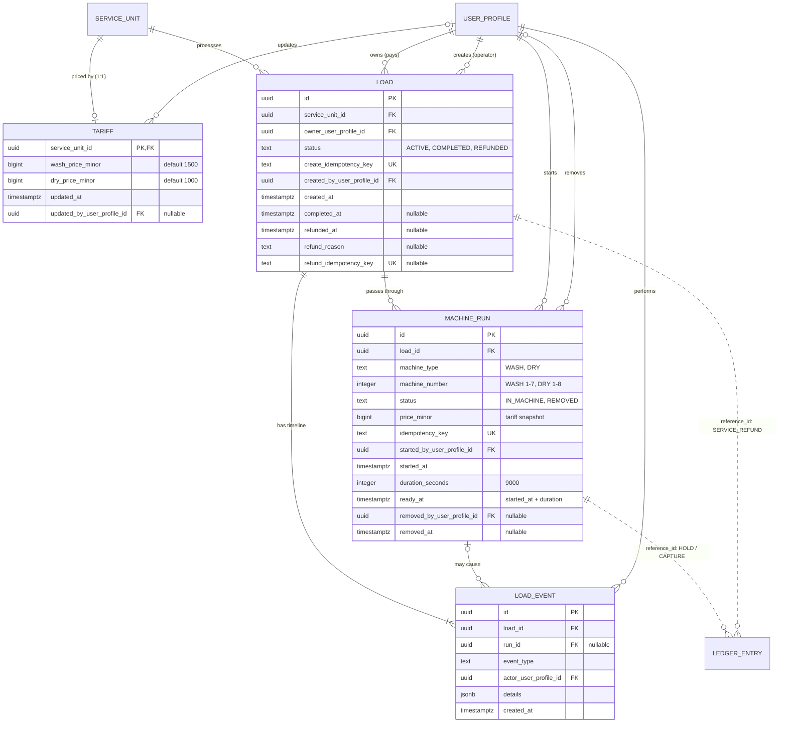
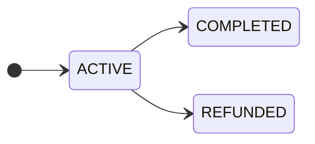
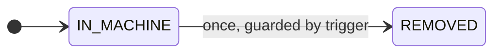
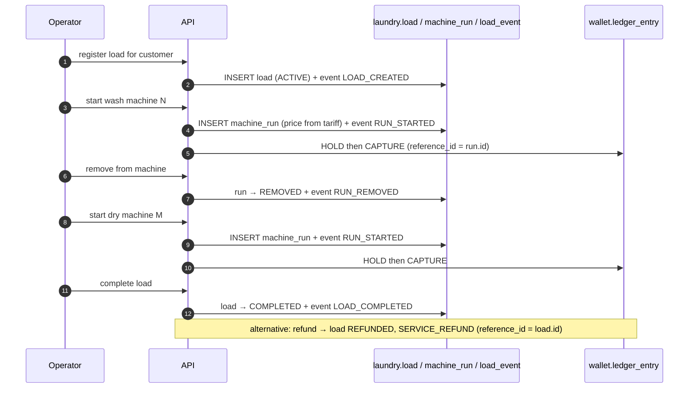

# `laundry` Schema — Tariffs, Loads and Machine Runs

Created by [`007_laundry.sql`](../../apps/api/migrations/007_laundry.sql) and
refined by:

- [`008_laundry_run_history_guard.sql`](../../apps/api/migrations/008_laundry_run_history_guard.sql) — one-way run updates
- [`009_laundry_run_timing.sql`](../../apps/api/migrations/009_laundry_run_timing.sql) — `duration_seconds`, `ready_at`
- [`010_laundry_fixed_duration.sql`](../../apps/api/migrations/010_laundry_fixed_duration.sql) — fixed duration check
- [`011_laundry_run_duration.sql`](../../apps/api/migrations/011_laundry_run_duration.sql) — duration set to 2 h 30 min (9000 s)

A **load** is one customer's batch of clothes. While it is active it passes
through one or more **machine runs** (wash, then dry, or a transfer to another
machine). Every step is recorded as a **load event**. Prices come from the
service unit's **tariff** and are snapshotted onto each run.

## At a glance

| Table                 | Role                               | Mutability                            | Key idea                                         |
| --------------------- | ---------------------------------- | ------------------------------------- | ------------------------------------------------ |
| `laundry.tariff`      | **Entity** – current prices        | mutable                               | one row per laundry unit (PK = FK)               |
| `laundry.load`        | **Entity** – a customer's batch    | status moves forward only             | `ACTIVE → COMPLETED / REFUNDED`                  |
| `laundry.machine_run` | **Entity** – one stay in a machine | one-way `IN_MACHINE → REMOVED`        | price snapshot, fixed 2 h 30 min timer           |
| `laundry.load_event`  | **Event** – load timeline          | immutable                             | audit trail, optionally tied to a run            |

**Design principles**

- **A machine holds one load, and a load sits in one machine** – both enforced by
  partial unique indexes on `status = 'IN_MACHINE'`, not by application code.
- **History is never rewritten.** Runs can only be marked `REMOVED` once; events
  cannot be changed or deleted.
- **Price snapshot.** `tariff` may change tomorrow; a run keeps the price it was
  started with.

## Entity–relationship diagram

Notation: `PK` primary key, `FK` foreign key, `UK` unique key. Dotted
relationships are logical (no database foreign key).

### Reading the diagram

| Relationship                       | Cardinality | Meaning                                                                |
| ---------------------------------- | ----------- | ---------------------------------------------------------------------- |
| `service_unit` → `tariff`          | 1 : 0..1    | The tariff row shares the unit's id as its primary key.                |
| `service_unit` → `load`            | 1 : N       | A laundry unit processes many loads.                                   |
| `user_profile` → `load` (owner)    | 1 : N       | The customer who is charged.                                           |
| `user_profile` → `load` (creator)  | 1 : N       | The operator who registered the load.                                  |
| `load` → `machine_run`             | 1 : N       | Wash, dry, or transfers; at most one run is `IN_MACHINE` at a time.    |
| `load` → `load_event`              | 1 : 1..N    | Starts with `LOAD_CREATED`.                                            |
| `machine_run` → `load_event`       | 1 : 0..N    | Only run-level events (`RUN_STARTED`, `RUN_REMOVED`) set `run_id`.     |

| Child column (holds the reference) | Referenced column | Cardinality / note | Type |
| --- | --- | --- | --- |
| `laundry.tariff.service_unit_id` | `core.service_unit.id` | 1 : 1, also the PK | Foreign key |
| `laundry.tariff.updated_by_user_profile_id` | `core.user_profile.id` | N : 0..1 | Foreign key |
| `laundry.load.service_unit_id` | `core.service_unit.id` | N : 1 | Foreign key |
| `laundry.load.owner_user_profile_id` | `core.user_profile.id` | N : 1 | Foreign key |
| `laundry.load.created_by_user_profile_id` | `core.user_profile.id` | N : 1 | Foreign key |
| `laundry.machine_run.load_id` | `laundry.load.id` | N : 1 | Foreign key |
| `laundry.machine_run.started_by_user_profile_id` | `core.user_profile.id` | N : 1 | Foreign key |
| `laundry.machine_run.removed_by_user_profile_id` | `core.user_profile.id` | N : 0..1 | Foreign key |
| `laundry.load_event.load_id` | `laundry.load.id` | N : 1 | Foreign key |
| `laundry.load_event.run_id` | `laundry.machine_run.id` | N : 0..1 | Foreign key |
| `laundry.load_event.actor_user_profile_id` | `core.user_profile.id` | N : 1 | Foreign key |
| `wallet.ledger_entry.reference_id` | `laundry.machine_run.id` | HOLD / CAPTURE per run | Logical (no FK) |
| `wallet.ledger_entry.reference_id` | `laundry.load.id` | SERVICE_REFUND for the whole load | Logical (no FK) |

`laundry.tariff` and `laundry.load` are siblings under the same service unit;
there is no FK between them. The tariff price is copied into
`machine_run.price_minor` when a run starts.

### State machines

**`laundry.load.status`**

**`laundry.machine_run.status`**

### Typical lifecycle

---

## `laundry.tariff`

Current prices for one laundry service unit. Seeded for `laundry-main`.

| Column                       | Type          | Null | Default | Constraints / notes                     |
| ---------------------------- | ------------- | ---- | ------- | --------------------------------------- |
| `service_unit_id`            | `uuid`        | no   |         | **PK**, **FK** → `core.service_unit.id` |
| `wash_price_minor`           | `bigint`      | no   | `1500`  | `> 0` and whole lira (`% 100 = 0`)      |
| `dry_price_minor`            | `bigint`      | no   | `1000`  | `> 0` and whole lira (`% 100 = 0`)      |
| `updated_at`                 | `timestamptz` | no   | `now()` |                                         |
| `updated_by_user_profile_id` | `uuid`        | yes  |         | **FK** → `core.user_profile.id`         |

---

## `laundry.load`

| Column                       | Type          | Null | Default             | Constraints / notes                                |
| ---------------------------- | ------------- | ---- | ------------------- | -------------------------------------------------- |
| `id`                         | `uuid`        | no   | `gen_random_uuid()` | **PK**                                             |
| `service_unit_id`            | `uuid`        | no   |                     | **FK** → `core.service_unit.id`                    |
| `owner_user_profile_id`      | `uuid`        | no   |                     | **FK** → `core.user_profile.id`; customer who pays |
| `status`                     | `text`        | no   | `'ACTIVE'`          | `ACTIVE`, `COMPLETED`, `REFUNDED`                  |
| `create_idempotency_key`     | `text`        | no   |                     | `UNIQUE`; 8–120 characters                         |
| `created_by_user_profile_id` | `uuid`        | no   |                     | **FK** → `core.user_profile.id`; operator          |
| `created_at`                 | `timestamptz` | no   | `now()`             |                                                    |
| `completed_at`               | `timestamptz` | yes  |                     |                                                    |
| `refunded_at`                | `timestamptz` | yes  |                     |                                                    |
| `refund_reason`              | `text`        | yes  |                     | 3–500 characters when present                      |
| `refund_idempotency_key`     | `text`        | yes  |                     | `UNIQUE`; 8–120 characters when present            |

### Status consistency check

| `status`    | `completed_at` | `refunded_at` | Also required                             |
| ----------- | -------------- | ------------- | ----------------------------------------- |
| `ACTIVE`    | `NULL`         | `NULL`        |                                           |
| `COMPLETED` | set            | `NULL`        |                                           |
| `REFUNDED`  | any            | set           | `refund_reason`, `refund_idempotency_key` |

Allowed transitions: `ACTIVE` → `COMPLETED` or `ACTIVE` → `REFUNDED`
(see the state diagram above).

| Index                            | Columns                                             |
| -------------------------------- | --------------------------------------------------- |
| `laundry_load_owner_created_idx` | `(owner_user_profile_id, created_at DESC, id DESC)` |

---

## `laundry.machine_run`

One stay of a load inside a specific machine.

| Column                       | Type          | Null | Default             | Constraints / notes                        |
| ---------------------------- | ------------- | ---- | ------------------- | ------------------------------------------ |
| `id`                         | `uuid`        | no   | `gen_random_uuid()` | **PK**                                     |
| `load_id`                    | `uuid`        | no   |                     | **FK** → `laundry.load.id`                 |
| `machine_type`               | `text`        | no   |                     | `WASH`, `DRY`                              |
| `machine_number`             | `integer`     | no   |                     | `WASH`: 1–7, `DRY`: 1–8                    |
| `status`                     | `text`        | no   | `'IN_MACHINE'`      | `IN_MACHINE`, `REMOVED`                    |
| `price_minor`                | `bigint`      | no   |                     | tariff snapshot; `> 0` and whole lira      |
| `idempotency_key`            | `text`        | no   |                     | `UNIQUE`; 8–120 characters                 |
| `started_by_user_profile_id` | `uuid`        | no   |                     | **FK** → `core.user_profile.id`            |
| `started_at`                 | `timestamptz` | no   | `now()`             |                                            |
| `duration_seconds`           | `integer`     | no   | `9000`              | must equal `9000` (2 h 30 min)             |
| `ready_at`                   | `timestamptz` | no   |                     | must equal `started_at + duration_seconds` |
| `removed_by_user_profile_id` | `uuid`        | yes  |                     | **FK** → `core.user_profile.id`            |
| `removed_at`                 | `timestamptz` | yes  |                     |                                            |

### Check constraints

| Rule                                                                                                    |
| ------------------------------------------------------------------------------------------------------- |
| `IN_MACHINE` ⇒ `removed_at` and `removed_by_user_profile_id` are `NULL`                                 |
| `REMOVED` ⇒ `removed_at` and `removed_by_user_profile_id` are set                                       |
| `laundry_machine_run_duration_check`: `duration_seconds = 9000`                                         |
| `laundry_machine_run_ready_at_check`: `ready_at = started_at + make_interval(secs => duration_seconds)` |

### Indexes

| Index                          | Columns                          | Notes                                                                          |
| ------------------------------ | -------------------------------- | ------------------------------------------------------------------------------ |
| `laundry_active_machine_idx`   | `(machine_type, machine_number)` | `UNIQUE`, partial `status = 'IN_MACHINE'` → a machine holds one load at a time |
| `laundry_active_load_run_idx`  | `(load_id)`                      | `UNIQUE`, partial `status = 'IN_MACHINE'` → a load is in one machine at a time |
| `laundry_run_load_started_idx` | `(load_id, started_at, id)`      | run history of a load                                                          |

### Triggers

| Trigger                                 | When                 | Effect                                                                                                                               |
| --------------------------------------- | -------------------- | ------------------------------------------------------------------------------------------------------------------------------------ |
| `laundry_machine_run_immutable_history` | `BEFORE DELETE`, row | raises `laundry history is immutable`                                                                                                |
| `laundry_machine_run_guard_update`      | `BEFORE UPDATE`, row | only allows `IN_MACHINE → REMOVED` while setting `removed_at` / `removed_by_user_profile_id`; every other column must stay unchanged |

| Child column (holds the reference) | Referenced column | Cardinality / note | Type |
| --- | --- | --- | --- |
| `IN_MACHINE` | `REMOVED` | one way, once | Foreign key |

Wallet link: starting or transferring a run writes a `HOLD` + `CAPTURE` pair
with `reference_id = machine_run.id`.

---

## `laundry.load_event`

Immutable timeline of a load.

| Column                  | Type          | Null | Default             | Constraints / notes                                                             |
| ----------------------- | ------------- | ---- | ------------------- | ------------------------------------------------------------------------------- |
| `id`                    | `uuid`        | no   | `gen_random_uuid()` | **PK**                                                                          |
| `load_id`               | `uuid`        | no   |                     | **FK** → `laundry.load.id`                                                      |
| `run_id`                | `uuid`        | yes  |                     | **FK** → `laundry.machine_run.id`; set for run-level events                     |
| `event_type`            | `text`        | no   |                     | `LOAD_CREATED`, `RUN_STARTED`, `RUN_REMOVED`, `LOAD_COMPLETED`, `LOAD_REFUNDED` |
| `actor_user_profile_id` | `uuid`        | no   |                     | **FK** → `core.user_profile.id`                                                 |
| `details`               | `jsonb`       | no   | `'{}'`              | free-form event payload                                                         |
| `created_at`            | `timestamptz` | no   | `now()`             |                                                                                 |

| Index / trigger                          | Definition                                  |
| ---------------------------------------- | ------------------------------------------- |
| `laundry_event_load_created_idx`         | `(load_id, created_at, id)`                 |
| `laundry_load_event_immutable` (trigger) | `BEFORE UPDATE OR DELETE` → raises an error |

### Typical lifecycle

Typical order of `event_type` values for one load:

1. `LOAD_CREATED`
2. `RUN_STARTED` (wash) → `RUN_REMOVED`
3. `RUN_STARTED` (dry) → `RUN_REMOVED`
4. `LOAD_COMPLETED` **or** `LOAD_REFUNDED`

