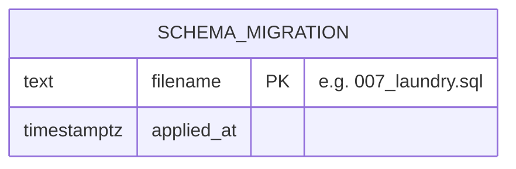
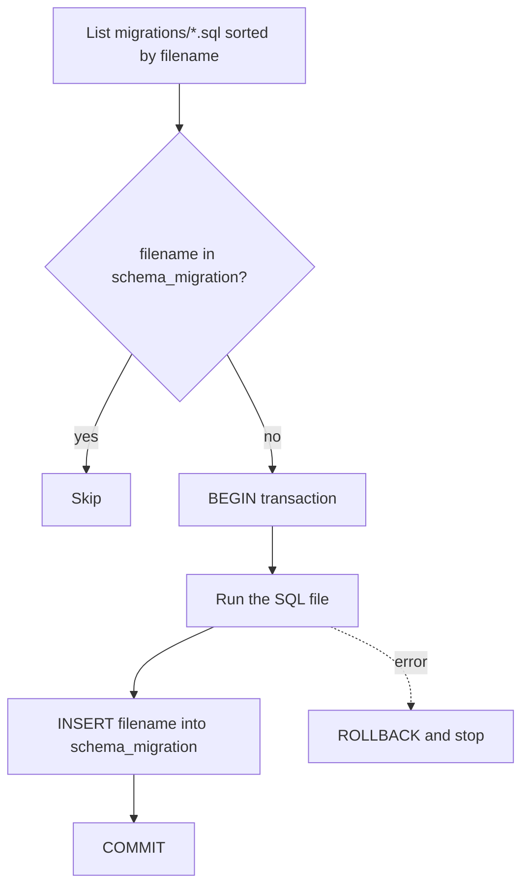

# Infrastructure — `public` and `audit` Schemas

These schemas hold no business data.

## `public.schema_migration`

Created on demand by the migration runner
[`apps/api/scripts/migrate.ts`](../../apps/api/scripts/migrate.ts), not by a
migration file. It records which migration files have already been applied.

| Column       | Type          | Null | Default | Constraints / notes            |
| ------------ | ------------- | ---- | ------- | ------------------------------ |
| `filename`   | `text`        | no   |         | **PK**; e.g. `007_laundry.sql` |
| `applied_at` | `timestamptz` | no   | `now()` |                                |

### Relationships

None. The table has no foreign keys and nothing references it.

### How the runner uses it

Because the filename is inserted in the same transaction as the SQL, a failed
migration leaves no trace and is retried on the next run.

The runner sorts `apps/api/migrations/*.sql` by filename, skips names already
present here, runs each new file in its own transaction and inserts its
filename only after the SQL succeeds.

## `audit` schema

Created by [`001_core.sql`](../../apps/api/migrations/001_core.sql) and by the
container init script
[`infra/postgres/init/001-create-databases.sql`](../../infra/postgres/init/001-create-databases.sql),
but it currently contains **no tables**. Audit history is instead kept next to
each domain in immutable event tables:

| Domain  | Audit table                                                   |
| ------- | ------------------------------------------------------------- |
| Wallet  | `wallet.ledger_entry`                                         |
| Canteen | `canteen.product_event`, `canteen.order_event`                |
| Laundry | `laundry.load_event` (plus the guarded `laundry.machine_run`) |
