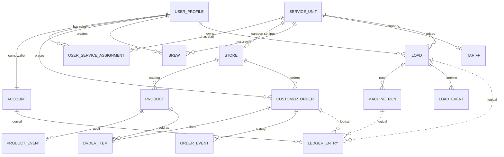
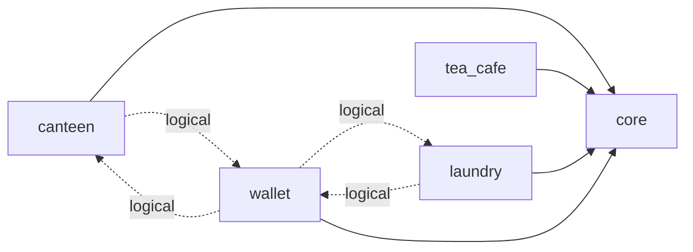

# Database Documentation

The application uses a single PostgreSQL database named `hizmet` (Keycloak uses
its own `keycloak` database on the same server). Every business area lives in
its own schema. The schema is defined only by the ordered migrations in
[`apps/api/migrations`](../../apps/api/migrations/README.md).

## Documents

| File                                             | Schema            | Tables                                                                             |
| ------------------------------------------------ | ----------------- | ---------------------------------------------------------------------------------- |
| [`01-core.md`](./01-core.md)                     | `core`            | `user_profile`, `service_unit`, `user_service_assignment`                          |
| [`02-wallet.md`](./02-wallet.md)                 | `wallet`          | `account`, `ledger_entry`                                                          |
| [`03-canteen.md`](./03-canteen.md)               | `canteen`         | `store`, `product`, `product_event`, `customer_order`, `order_item`, `order_event` |
| [`04-tea-cafe.md`](./04-tea-cafe.md)             | `tea_cafe`        | `brew`                                                                             |
| [`05-laundry.md`](./05-laundry.md)               | `laundry`         | `tariff`, `load`, `machine_run`, `load_event`                                      |
| [`06-infrastructure.md`](./06-infrastructure.md) | `public`, `audit` | `schema_migration` (migration bookkeeping), empty `audit` schema                   |

## Domain model in one picture

The model is built around two **hub entities** (`user_profile`, `service_unit`),
one **ledger** that records all money movement, and three **service schemas**
that each own their own tables.

> [!NOTE]
> This overview shows only the **business-level** relationships (one line per
> pair of tables, dotted = logical). Actor columns such as
> `actor_user_profile_id` also point to `user_profile` and are listed in each
> schema document. Attributes are shown in the per-schema ER diagrams.

### Layers

| Layer               | Tables                                              | Responsibility                       |
| ------------------- | --------------------------------------------------- | ------------------------------------ |
| **Identity**        | `core.user_profile`, `core.user_service_assignment` | who a person is and what they may do |
| **Organisation**    | `core.service_unit`                                 | which services exist                 |
| **Money**           | `wallet.account`, `wallet.ledger_entry`             | balances and an immutable journal    |
| **Service data**    | `canteen.*`, `tea_cafe.brew`, `laundry.*`           | what each service sells or processes |
| **Audit / history** | `*_event` tables, `wallet.ledger_entry`             | append-only record of what happened  |
| **Infrastructure**  | `public.schema_migration`                           | migration bookkeeping                |

### Schema dependency direction

Dependencies only point **towards** `core` (and `wallet`); `core` knows nothing
about the services. The only link in the opposite direction is the logical
`ledger_entry.service_code / reference_id` pair, which is deliberately not a
foreign key.

Read it as "depends on". The wallet is _used by_ canteen and laundry, but the
database never enforces it; the API does it within one transaction.

## Terminology

| Term             | Meaning in this documentation                                                          |
| ---------------- | -------------------------------------------------------------------------------------- |
| **Entity**       | A table describing a real-world thing with its own identity (user, product…).          |
| **Association**  | A bridge table that resolves a many-to-many (`order_item`, `user_service_assignment`). |
| **Event**        | An append-only table describing something that happened (`*_event`, ledger).           |
| **Attribute**    | A column of a table.                                                                   |
| **PK / FK / UK** | Primary key / foreign key / unique key.                                                |
| **Minor units**  | Money in kuruş (1 TRY = 100); columns end in `_minor`.                                 |
| **Snapshot**     | A copy of a value taken when a record is created (e.g. price on an order line).        |

## How to read the relationship notation

Every document shows each relationship twice: as an ER diagram (crow's foot)
and as a table. In the tables, each row reads **"child column → referenced
column"**: the first column is the table that **holds the foreign key**, the
second is the table that is **referenced**.

| Child column (holds the reference) | Referenced column | Cardinality / note | Type        |
| ---------------------------------- | ----------------- | ------------------ | ----------- |
| `child_table.fk_column`            | `parent_table.id` | N : 1              | Foreign key |

| Value           | Meaning                                                           |
| --------------- | ----------------------------------------------------------------- |
| Foreign key     | Real foreign key enforced by PostgreSQL                           |
| Logical (no FK) | Reference stored as plain data; **not** enforced by a database FK |
| `N : 1`         | Many child rows may point to the same parent row                  |
| `1 : 1`         | The FK column is also `UNIQUE` (or the primary key)               |
| `0..1`          | The FK column is nullable, so the reference is optional           |

ER diagram symbols:

| Symbol / line style  | Meaning              |
| -------------------- | -------------------- |
| `PK`                 | primary key          |
| `FK`                 | foreign key          |
| `UK`                 | unique key           |
| solid line           | enforced foreign key |
| dotted line          | logical link (no FK) |
| bar on the line end  | exactly one          |
| circle + bar         | zero or one          |
| circle + crow's foot | zero or many         |
| bar + crow's foot    | one or many          |

## Shared conventions

- **Primary keys** are `uuid` values generated by `gen_random_uuid()`
  (`pgcrypto` extension). Exceptions: `core.user_service_assignment` (composite
  key), `laundry.tariff` (keyed by `service_unit_id`) and
  `public.schema_migration` (keyed by `filename`).
- **Money** is stored as `bigint` minor units (kuruş) in columns ending in
  `_minor`. Currency is fixed to `TRY`. Catalog, tariff and laundry prices must
  be whole lira (`% 100 = 0`).
- **Timestamps** are `timestamptz`, defaulting to `now()`.
- **Enumerations** are `text` columns restricted by `CHECK (... IN (...))`
  constraints rather than PostgreSQL enum types.
- **Idempotency keys** are `UNIQUE` text columns (8–200 characters) so a
  retried request can never create a second row.
- **History is immutable.** Ledger entries and every `*_event` table reject
  `UPDATE`/`DELETE` through triggers. Laundry machine runs may only move once
  from `IN_MACHINE` to `REMOVED`.
- **Soft deletes** are used instead of `DELETE` (`archived_at`, `deleted_at`).
