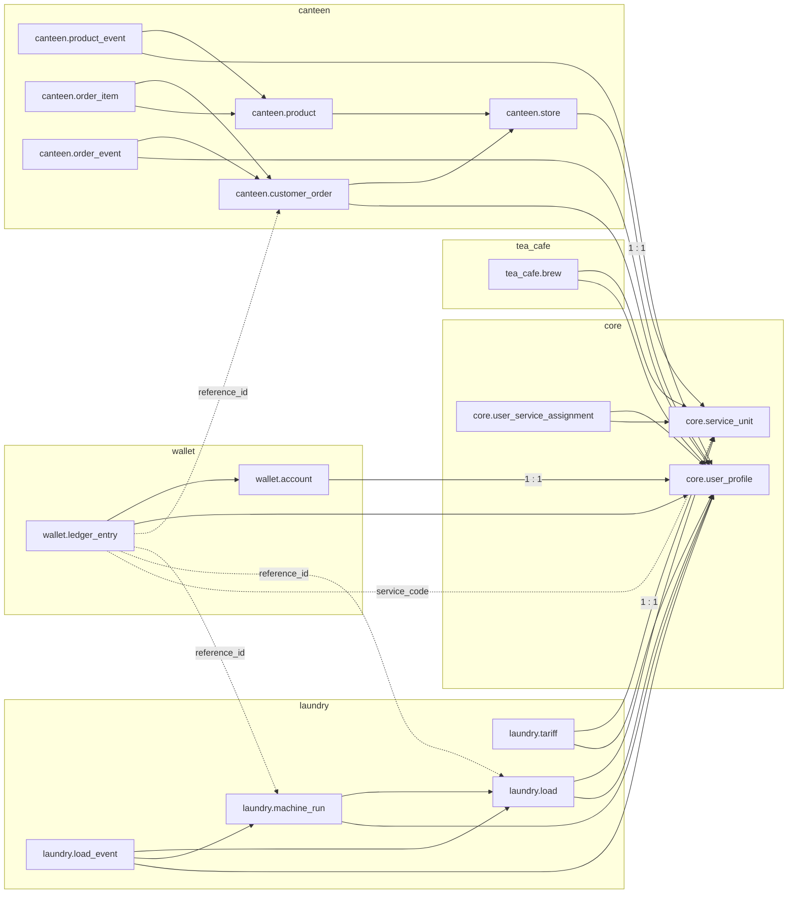

# Database Documentation

The application uses a single PostgreSQL database named `hizmet` (Keycloak uses
its own `keycloak` database on the same server). Every business area lives in
its own schema. The schema is defined only by the ordered migrations in
[`apps/api/migrations`](../../apps/api/migrations/README.md).

## Documents

| File                                             | Schema            | Tables                                                                             |
| ------------------------------------------------ | ----------------- | ---------------------------------------------------------------------------------- |
| [`01-core.md`](./01-core.md)                     | `core`            | `user_profile`, `service_unit`, `user_service_assignment`                          |
| [`02-wallet.md`](./02-wallet.md)                 | `wallet`          | `account`, `ledger_entry`                                                          |
| [`03-canteen.md`](./03-canteen.md)               | `canteen`         | `store`, `product`, `product_event`, `customer_order`, `order_item`, `order_event` |
| [`04-tea-cafe.md`](./04-tea-cafe.md)             | `tea_cafe`        | `brew`                                                                             |
| [`05-laundry.md`](./05-laundry.md)               | `laundry`         | `tariff`, `load`, `machine_run`, `load_event`                                      |
| [`06-infrastructure.md`](./06-infrastructure.md) | `public`, `audit` | `schema_migration` (migration bookkeeping), empty `audit` schema                   |

## How to read the relationship notation

Every document uses the same arrow notation. The arrow always points from the
table that **holds the foreign key** to the table that is **referenced**.

```text
child_table.fk_column  ──►  parent_table.id      (N : 1)
```

| Symbol  | Meaning                                                          |
| ------- | ---------------------------------------------------------------- |
| `──►`   | Real foreign key enforced by PostgreSQL                          |
| `┄┄►`   | Logical reference stored as plain data; **not** enforced by a FK |
| `N : 1` | Many child rows may point to the same parent row                 |
| `1 : 1` | The FK column is also `UNIQUE` (or the primary key)              |
| `0..1`  | The FK column is nullable, so the reference is optional          |

The Mermaid diagrams use the same direction: `child --> parent`.

## Cross-schema overview

`core.user_profile` and `core.service_unit` are the two hubs. Every other
schema hangs off them.



Dotted arrows are the logical (non-FK) links from the wallet ledger to the
service that caused a money movement. See [`02-wallet.md`](./02-wallet.md).

## Shared conventions

- **Primary keys** are `uuid` values generated by `gen_random_uuid()`
  (`pgcrypto` extension). Exceptions: `core.user_service_assignment` (composite
  key), `laundry.tariff` (keyed by `service_unit_id`) and
  `public.schema_migration` (keyed by `filename`).
- **Money** is stored as `bigint` minor units (kuruş) in columns ending in
  `_minor`. Currency is fixed to `TRY`. Catalog, tariff and laundry prices must
  be whole lira (`% 100 = 0`).
- **Timestamps** are `timestamptz`, defaulting to `now()`.
- **Enumerations** are `text` columns restricted by `CHECK (... IN (...))`
  constraints rather than PostgreSQL enum types.
- **Idempotency keys** are `UNIQUE` text columns (8–200 characters) so a
  retried request can never create a second row.
- **History is immutable.** Ledger entries and every `*_event` table reject
  `UPDATE`/`DELETE` through triggers. Laundry machine runs may only move once
  from `IN_MACHINE` to `REMOVED`.
- **Soft deletes** are used instead of `DELETE` (`archived_at`, `deleted_at`).
